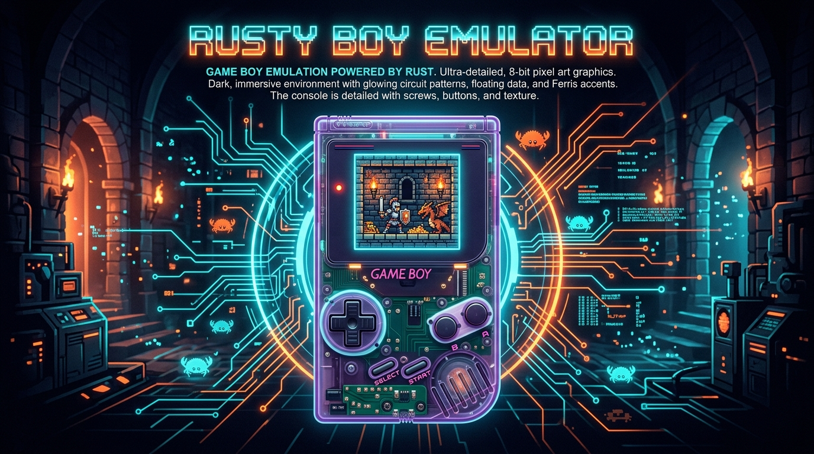
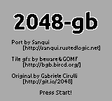

# Game Boy (LR35902) Emulator in Rust



[](https://github.com/ImL1s/gb_emulator/actions/workflows/ci.yml)
[](https://opensource.org/licenses/MIT)
[](https://www.rust-lang.org/)
[]()

A clean-room, highly accurate Game Boy (DMG / LR35902) emulator written in Rust. Features a modular architecture, accurate cycle timing, PPU 2D rendering pipeline, battery-backed SRAM persistence, an interactive SDL2 GUI window, and a headless verification test harness for automated CI/CD validation.

---

## 🎮 Features

- **LR35902 CPU Core**:
  - Full implementation of all 256 base opcodes and 256 CB-prefixed opcodes.
  - Complete register set (`A`, `B`, `C`, `D`, `E`, `H`, `L`, `F`, `SP`, `PC`) with flags `Z`, `N`, `H`, `C`.
  - Accurate CPU cycle accounting, `HALT` (including HALT bug) and `STOP` states.
  - 5 hardware interrupt vectors: VBlank, LCD STAT, Timer, Serial, and Joypad.
- **Memory Management Unit (MMU)**:
  - Standard 64KB Game Boy memory map routing (ROM, VRAM, SRAM, WRAM, Echo RAM, OAM, I/O, HRAM, IE).
  - Multiple Cartridge Bank Controllers: **NoMBC**, **MBC1**, **MBC3** (with RTC clock latching support), and **MBC5**.
  - Battery-backed SRAM (`.sav`) file persistence across gaming sessions.
- **Picture Processing Unit (PPU)**:
  - 160x144 pixel 2-bit grayscale (4-color palette) framebuffer output.
  - Precise mode timing state machine (Mode 0 HBlank, Mode 1 VBlank, Mode 2 OAM Search, Mode 3 Pixel Transfer).
  - Background layer rendering with SCX/SCY wrapping scrolling.
  - Window layer rendering with WX/WY positioning and internal line counter.
  - Sprite (OBJ) layer rendering with 8x8 & 8x16 modes, palette selection, X/Y flip, transparency, and DMG X-coordinate/OAM-index priority sorting.
- **Peripherals**:
  - **Timer**: Divider (`DIV`), Timer Counter (`TIMA`), Timer Modulo (`TMA`), Control (`TAC`), and frequency write glitch modeling.
  - **Serial**: Text serial output (`0xFF01`/`0xFF02`) capture for headless Blargg test ROM output.
  - **Joypad**: `0xFF00` key matrix polling and interrupt triggering.
- **User Interface & Test Automation**:
  - Interactive SDL2 window running smoothly at 60 FPS.
  - Keyboard controls mapping.
  - Automated headless runner mode (`--headless`) and framebuffer export (`--screenshot`).

---

## 📋 Prerequisites & Installation

### 1. Install Rust
Ensure you have Rust installed (1.70+ recommended):
```bash
curl --proto '=https' --tlsv1.2 -sSf https://sh.rustup.rs | sh
```

### 2. System Dependencies (SDL2)

#### macOS
```bash
brew install sdl2
```

#### Ubuntu / Debian
```bash
sudo apt-get update
sudo apt-get install libsdl2-dev
```

#### Windows
Ensure `SDL2.dll` is installed or available in your `%PATH%` or crate build path.

---

## 🚀 Quick Start

### Building the Emulator
```bash
cargo build --release
```

### Running the Included Open-Source Game (2048-GB)
```bash
cargo run --release -- examples/2048.gb
```


### Running Any Commercial or Custom Game ROM
```bash
cargo run --release -- path/to/game.gb
```

### CLI Command Options
| Option | Description | Example |
| :--- | :--- | :--- |
| `<ROM_PATH>` | Path to `.gb` game cartridge ROM file | `cargo run --release -- game.gb` |
| `--headless` | Run in headless execution mode without opening GUI window | `cargo run --release -- --headless test.gb` |
| `--screenshot <PATH>` | Save rendered 160x144 framebuffer screenshot to PPM file | `cargo run --release -- --screenshot out.ppm game.gb` |

---

## ⌨️ Controls

| Game Boy Button | Keyboard Key |
| :--- | :--- |
| **D-Pad Up** | Up Arrow (`↑`) |
| **D-Pad Down** | Down Arrow (`↓`) |
| **D-Pad Left** | Left Arrow (`←`) |
| **D-Pad Right** | Right Arrow (`→`) |
| **A Button** | `Z` |
| **B Button** | `X` |
| **Start** | `Enter` |
| **Select** | `Right Shift` |

---

## 🧪 Testing & Verification

### Running Unit & Adversarial Integration Tests
```bash
cargo test
```

### Running Blargg Test ROM Suite (Headless Verification)
The project includes an automated test harness script `scripts/run_gb_tests.sh` that fetches Blargg's CPU test ROMs and runs them in headless mode:

```bash
./scripts/run_gb_tests.sh
```

**Test Suites Validated**:
- `cpu_instrs.gb` (All 11 sub-tests: `01-special` through `11-op a,(hl)`)
- `instr_timing.gb`

All 13 test ROMs pass cleanly with `Exit Code 0`.

---

## 🏛️ Project Architecture

```
gb_emulator/
├── .cargo/
│   └── config.toml       # Automatic Homebrew SDL2 linker search paths
├── .github/
│   └── workflows/
│       ├── ci.yml        # Multi-platform CI pipeline (fmt, clippy, tests, blargg)
│       └── release.yml   # Multi-platform release asset builder (Linux, macOS, Windows)
├── docs/                 # Documentation assets & screenshots
├── examples/             # Included open-source homebrew games (2048-GB)
├── scripts/
│   └── run_gb_tests.sh   # Headless Blargg test ROM runner script
├── src/
│   ├── main.rs           # CLI entry point & clap argument parser
│   ├── lib.rs            # Core emulator library exports
│   ├── cpu/              # LR35902 CPU implementation (opcodes, registers, ALU)
│   ├── mmu/              # Memory Management Unit & Bus router
│   ├── cartridge/        # Cartridge bank controllers (NoMBC, MBC1, MBC3, MBC5)
│   ├── ppu/              # Picture Processing Unit (LCD, renderer, framebuffer)
│   ├── timer/            # Hardware Timer (DIV, TIMA, TMA, TAC)
│   ├── serial/           # Serial Data Transfer (SB, SC)
│   ├── joypad/           # Joypad Input Matrix (0xFF00)
│   └── frontend/         # SDL2 GUI window & headless runner
└── tests/                # Comprehensive adversarial integration test suite
```

---

## ⚖️ Legal Disclaimer

This emulator is built strictly for educational, research, and legal homebrew testing purposes. This project does NOT distribute copyrighted commercial Game Boy ROMs. All sample games included in this repository (such as `2048.gb`) are open-source and released under permissive licenses (e.g. Zlib License).

---

## 📄 License

This project is licensed under the [MIT License](LICENSE).
